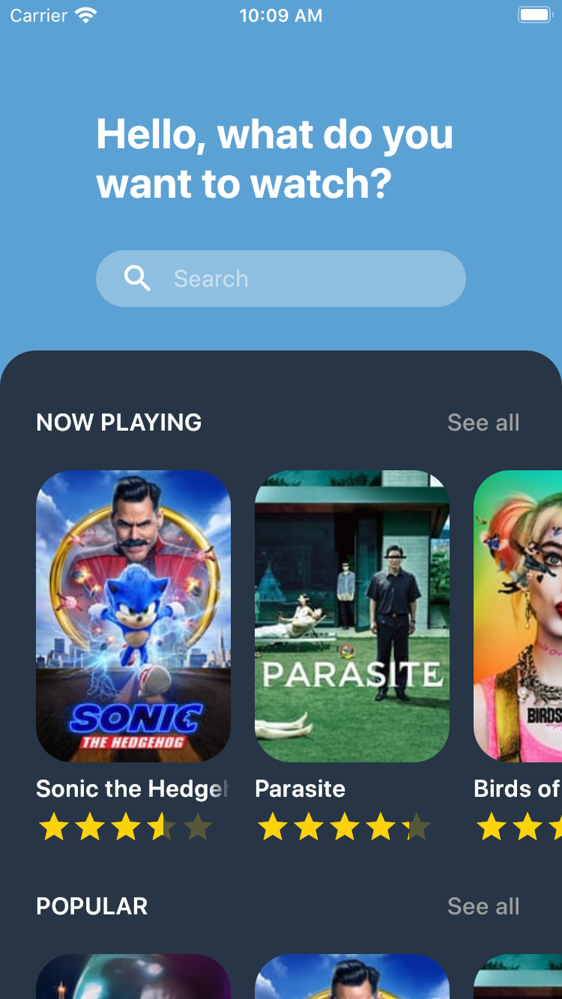
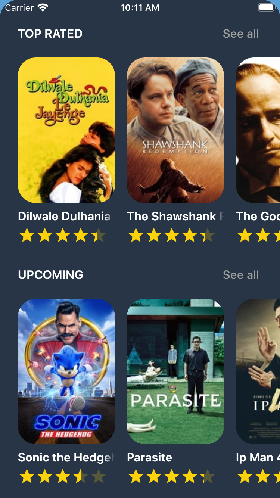
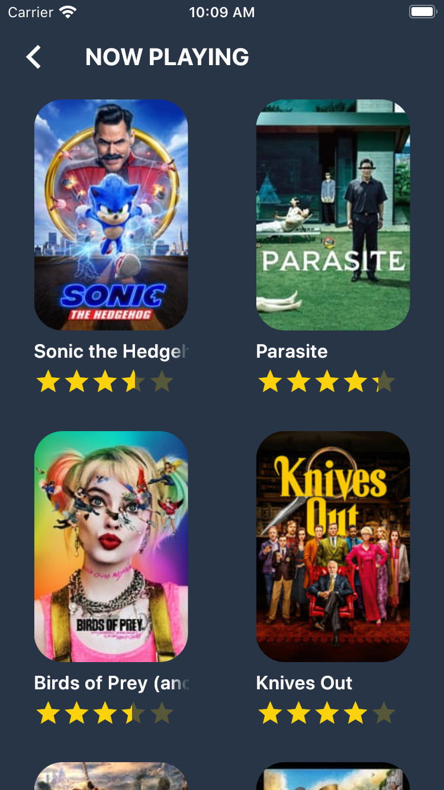
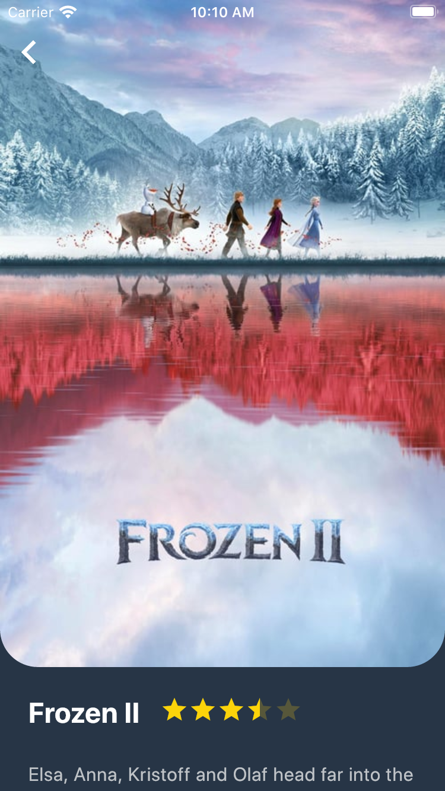
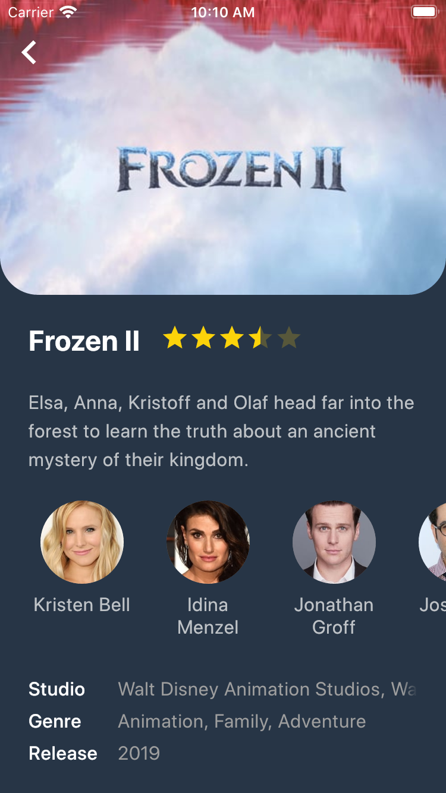

Movies
======

[Design used](https://www.uplabs.com/posts/movies-e0f9c1ea-a644-4666-857b-10933c4089ca)

Running
-------

Requires the latest Flutter version (v1.12.13).

1. Connect a device or open the emulator/simulator.
2. Run `flutter run`

Tested on iPhone 8 and 11 (Simulator) and Samsung S10e.

Screenshots
-----------

    
    
    
    
    

